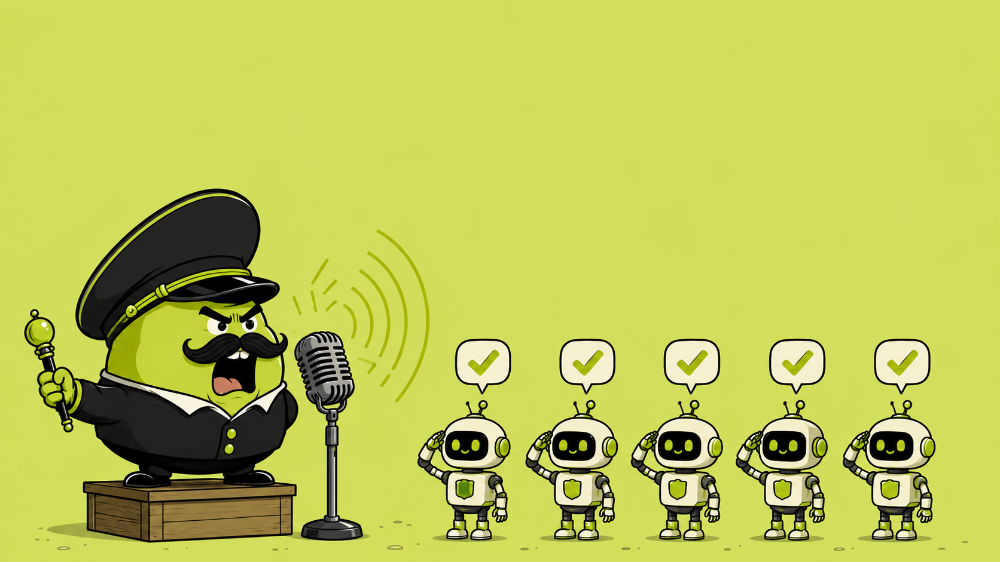

# Dictator



**Local push-to-talk dictation, for people who'd rather bark orders at their AI agent than type them.** Hold a key, talk, and the recognized text lands wherever your cursor is — your terminal, an AI chat box, an editor, Slack, anywhere. 100% on-device via [faster-whisper](https://github.com/SYSTRAN/faster-whisper). No cloud, no rate limits, no per-word cost.

Built especially for **[Claude Code](https://claude.com/claude-code)**, which has no native push-to-talk: hold the key, ramble your intent for a few minutes the way you'd brief a person, release, and the whole thing lands as text in your prompt.

This is the open, local answer to tools like Wispr Flow / Superwhisper.

## Set it up by pointing an AI agent at this repo

You don't need to read the rest of this file. Clone this repo, then hand your coding agent (Claude Code or similar) this:

> Read `AGENT_SETUP.md` in this repo and follow it to install and run Dictator on this Mac.

It will run every command itself and only stop to ask you for the two things macOS requires a human to click — a Microphone prompt and an Accessibility toggle. See **[AGENT_SETUP.md](AGENT_SETUP.md)** for what it will do, or to run the steps yourself.

## How it works

```
hold Right ⌥  ──▶  mic captured to memory  ──▶  faster-whisper (small, warm in RAM)
                                                          │
   text pasted at your cursor  ◀── clipboard ⌘V / typing ─┘
```

- **Trigger:** push-to-talk (hold a key) and/or toggle (tap on, tap off). No always-listening.
- **Model:** `small` by default — the latency/accuracy sweet spot for TR+EN on Apple Silicon CPU (~2s per utterance). See the model table below to trade speed for accuracy.
- **Insertion:** clipboard-paste (⌘V) by default, with automatic fall back to simulated typing where paste is blocked.
- **Feedback:** start/stop chime + a macOS menu-bar status dot (🎙️ idle / 🔴 recording / ✍️ transcribing).

## Install

```bash
git clone https://github.com/alperencngz/dictator.git
cd dictator
uv venv --python 3.12
uv pip install -e .
```

## Run it as a Mac app (recommended)

`Dictator.app` is a real macOS app — launch it from Spotlight, Finder, or your Dock, no
terminal needed. It's a py2app **alias-mode** bundle: it runs this repo's `dictator/`
source and `.venv` in place, so it only works on this machine, but source edits go live
on relaunch with **no rebuild**.

```bash
./mac/build_app.sh
cp -R dist/Dictator.app /Applications/
```

Then **⌘Space → "Dictator" → Enter**. It runs headless in the menu bar (🎙️, top-right) —
no Dock icon, no window, by design (`LSUIElement`).

**Auto-start at login** (so it's already running after every reboot, no manual launch):

```bash
cp mac/io.github.alperencngz.dictator.plist ~/Library/LaunchAgents/   # or symlink it
launchctl bootstrap gui/$(id -u) ~/Library/LaunchAgents/io.github.alperencngz.dictator.plist
```

> **Rebuilding resets its Accessibility grant.** `build_app.sh` re-signs the bundle
> (ad-hoc signature), and macOS ties the Accessibility permission to that signature — so
> after every rebuild you must re-grant it: System Settings → Privacy & Security →
> Accessibility → remove the old "Dictator" entry if present → **+** → re-add
> `/Applications/Dictator.app` → toggle on. If it still won't take, run
> `tccutil reset Accessibility io.github.alperencngz.dictator` first to clear a stale entry, then
> re-add. Only rebuilding needs this — plain source edits don't.

## macOS permissions (one-time)

System Settings → Privacy & Security, grant your **terminal app** (or whatever runs `dictator`):

- **Microphone** — to record you.
- **Accessibility** — this is the one that matters. It gates **both** the global push-to-talk hotkey (a Quartz CGEventTap) **and** simulating ⌘V / typing into other apps. If the ready chime plays but holding the key does nothing, this toggle is off.
- **Input Monitoring** — usually *not* required for the hotkey. Grant it only if macOS also lists the app here and keystrokes still don't arrive after Accessibility is on.

> **Dictator.app has its own permission identity.** macOS attributes Accessibility / Microphone grants to the specific app bundle that asks. Granting your terminal does **not** grant `Dictator.app` — when you run the bundled app, grant it separately (Settings → Privacy & Security → Accessibility → **+** → select `Dictator.app`). Grants do not transfer between the two.

Run `dictator doctor` — it probes both permissions live and tells you exactly what's missing.

## Usage

```bash
dictator run            # start the daemon (loads model, then listens)
dictator devices        # list microphones (set input_device in config)
dictator config         # show config path + current settings
dictator test-insert    # focus a field, verifies insertion + permissions
dictator doctor         # dependency + permissions check
```

Then: focus any text field, **hold Right ⌥**, speak, release. The text appears.

## Configuration

Edit `~/.dictator/config.yaml` (created on first run). Key options:

| Key | Default | Notes |
|-----|---------|-------|
| `model` | `small` | see model table below |
| `language` | `null` | `null` = autodetect; or force `en` / `tr` |
| `ptt_key` | `<alt_r>` | push-to-talk hold key |
| `toggle_key` | `null` | tap-on/tap-off key; `null` = unbound |
| `insert_method` | `paste` | `paste` or `type` |
| `paste_fallback_to_type` | `true` | type if paste is blocked |
| `restore_clipboard` | `true` | put your old clipboard back after pasting |
| `input_device` | `null` | mic index from `dictator devices` |
| `sound_feedback` | `true` | start/stop chime |
| `menu_bar` | `true` | macOS menu-bar status icon |

Key names follow pynput syntax: `<alt_r>` (Right Option), `<cmd>`, `<ctrl>+<alt>+d`, `f9`, etc.

### Choosing a model

Measured on an Apple Silicon Mac (CPU; ctranslate2 has no Metal backend) for a ~5s clip:

| model | latency | English | Turkish | notes |
|-------|---------|---------|---------|-------|
| `base` | ~0.6s | good | weaker | fastest usable; fine if you mostly dictate English |
| `small` | **~2s** | excellent | good | **default** — best balance for TR+EN |
| `large-v3-turbo` | ~8s | excellent | best | most accurate multilingual, but ~4× slower here |
| `distil-large-v3` | ~8s | excellent | ❌ none | **English-only** — do not use for Turkish |

The model is loaded once and kept warm in RAM, so these are steady-state per-utterance times with no reload cost.

## Why local

Audio never leaves your machine. There's no network call at all in the dictation path — so no rate limits and nothing to pay for.
